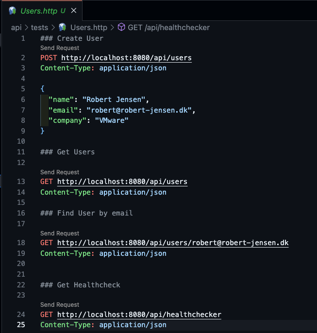

# API

# Tests Folder

In the tests folder, you will find .,html files.
The purpose of these files, is to automate API testing, by having pre configured api calls, that can be run fro VS code, or any other compatible IDE.

### Pre Requirements

To make tests work in VS Code, you have to install the [Rest Client plugin](https://marketplace.visualstudio.com/items?itemName=humao.rest-client) first.

### Usage

Open the file in VS Code, and click on the "Send request" button, above the command, to execute the API request.

